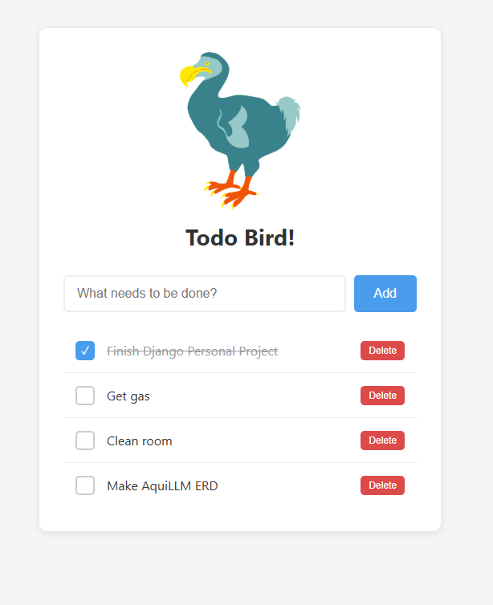

# Todo Bird

A simple to-do list app built with Django.



 
 
 
 
## Setup

1. **Create a virtual environment** (recommended):
   ```bash
   python3 -m venv venv
   source venv/bin/activate  # On Windows: venv\Scripts\activate
   ```

2. **Install Django**:
   ```bash
   pip install django
   ```

3. **Run migrations** (creates the database):
   ```bash
   python3 manage.py migrate
   ```

4. **Create an admin account** (optional, for /admin panel):
   ```bash
   python3 manage.py createsuperuser
   ```

## Running the App

```bash
python3 manage.py runserver
```

Then visit: http://127.0.0.1:8000/

Admin panel: http://127.0.0.1:8000/admin/

## Project Structure

```
todoproject/          # Project config (settings, main urls)
todos/                # The todo app
├── models.py         # Data structure (Todo model)
├── views.py          # Request handling logic
├── urls.py           # URL routing for this app
├── templates/        # HTML templates
└── static/           # CSS, images
```
